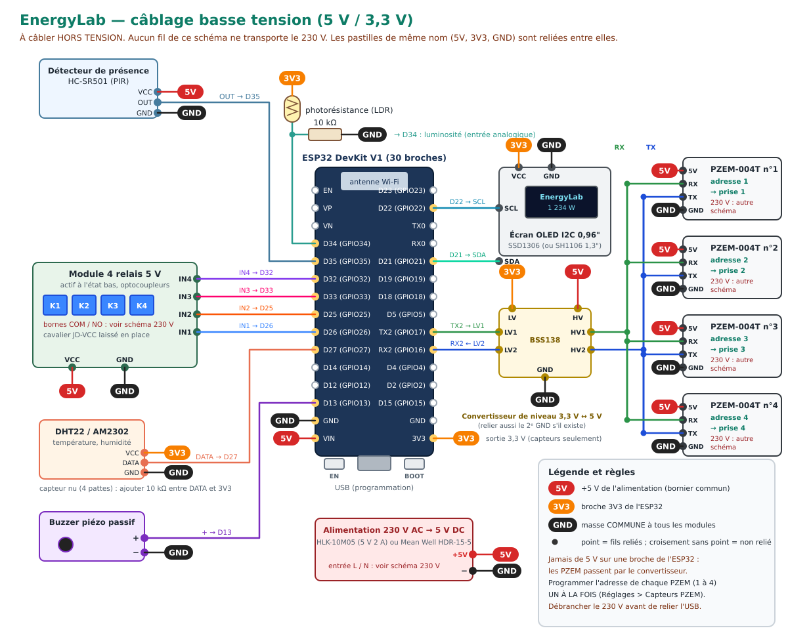
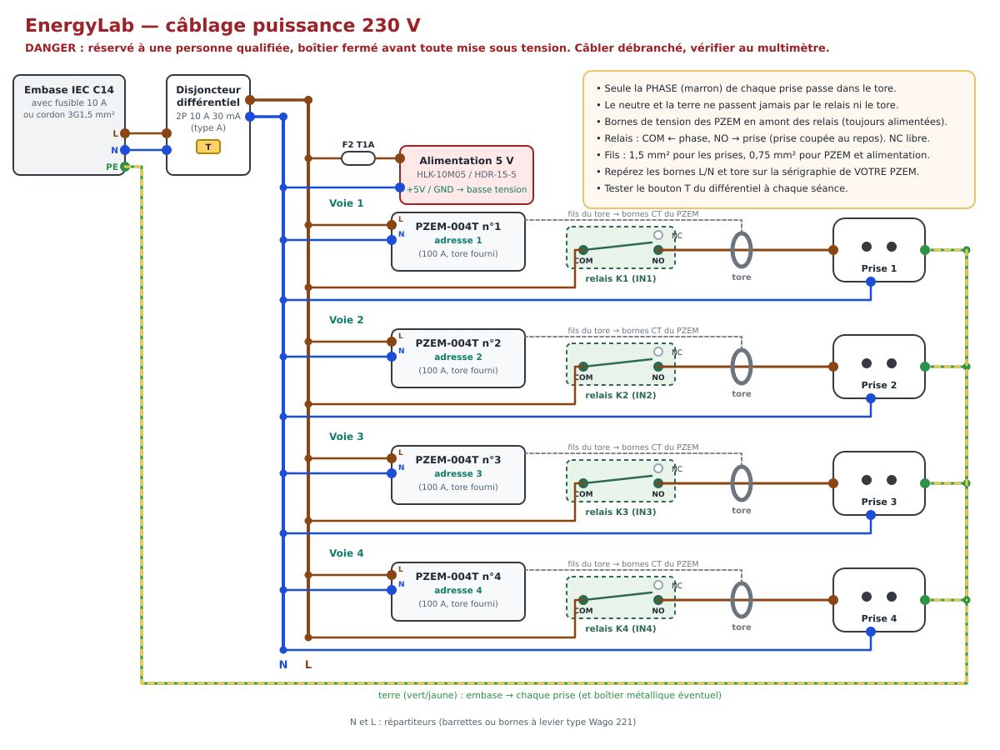

# 2. Guide de câblage pas à pas

> ⚠️ **Le kit contient du 230 V.** Le câblage de la partie puissance doit être réalisé ou vérifié par une
> personne habilitée. Travaillez toujours **cordon débranché**. Le boîtier doit être **fermé** et le
> différentiel 30 mA **testé** avant chaque utilisation avec des apprenants.

Deux schémas accompagnent ce guide (ils sont aussi dans l'onglet *Aide & câblage* de l'application) :

| Basse tension (5 V / 3,3 V) | Puissance (230 V) |
|---|---|
|  |  |

Ouvrez-les en grand : [basse tension](img/cablage-basse-tension.svg) · [230 V](img/cablage-230v.svg).

On procède en **5 étapes**, chacune vérifiée avant de passer à la suivante :

1. flasher l'ESP32 (voir [03-installation.md](03-installation.md)) ;
2. câbler et tester **toute la basse tension sur table**, alimentée par l'USB (aucun 230 V) ;
3. câbler la partie 230 V dans le boîtier, **hors tension** ;
4. contrôler au multimètre, puis première mise sous tension ;
5. attribuer les adresses des capteurs PZEM et vérifier les mesures.

---

## 2.1 Organisation du boîtier

Séparez physiquement deux zones :

- **zone 230 V** : embase, disjoncteur différentiel, répartiteurs, alimentation 5 V, côté « secteur » des
  PZEM, borniers à vis du module relais, tores, prises ;
- **zone basse tension** : ESP32, carte de répartition 5 V / 3V3 / GND, convertisseur de niveau, écran,
  capteurs, côté « TTL » des PZEM, broches IN du module relais.

Le module relais et les PZEM sont à cheval sur les deux zones : orientez leurs borniers 230 V vers la zone
230 V. Aucun fil basse tension ne doit passer au contact d'une borne 230 V (gardez au moins 8 mm, ou une
cloison). Fixez chaque module sur entretoises ; attachez les fils avec des colliers.

## 2.2 Étape 2 — basse tension sur table (sans 230 V)

Matériel : ESP32 déjà flashé, module relais, convertisseur BSS138, écran, DHT22, LDR + 10 kΩ, HC-SR501,
buzzer. Les PZEM peuvent attendre l'étape 5.

### Carte de répartition

Sur une petite plaque à bandes, créez trois rails reliés par des barrettes femelles :

- **5V** (fil rouge) : recevra le **+5 V de l'alimentation**, la broche **VIN** de l'ESP32, VCC du module
  relais, HV du convertisseur, VCC du HC-SR501 et la broche 5V des 4 PZEM ;
- **GND** (fil noir) : **masse commune** de TOUS les modules (alimentation, ESP32, relais, convertisseur des
  deux côtés, écran, capteurs, PZEM) ;
- **3V3** (fil orange) : relié à la broche **3V3** de l'ESP32 ; alimente l'écran, le DHT22, la LDR et le
  côté LV du convertisseur. Ne jamais y relier le 5 V.

### Tableau de câblage

| Module | Broche du module | Va vers | Remarque |
|---|---|---|---|
| Module relais | IN1 | **GPIO26** (D26) | prise 1 |
| | IN2 | **GPIO25** (D25) | prise 2 |
| | IN3 | **GPIO33** (D33) | prise 3 |
| | IN4 | **GPIO32** (D32) | prise 4 |
| | VCC / GND | 5V / GND | laisser le cavalier JD-VCC ↔ VCC en place |
| Convertisseur BSS138 | LV / GND (côté LV) | 3V3 / GND | |
| | HV / GND (côté HV) | 5V / GND | |
| | LV1 | **GPIO17** (TX2) | données ESP32 → PZEM |
| | HV1 | **RX des 4 PZEM** (reliés ensemble) | |
| | LV2 | **GPIO16** (RX2) | données PZEM → ESP32 |
| | HV2 | **TX des 4 PZEM** (reliés ensemble) | |
| PZEM-004T ×4 (connecteur TTL) | 5V / GND | 5V / GND | |
| Écran OLED | VCC / GND | 3V3 / GND | |
| | SDA / SCL | **GPIO21** / **GPIO22** | |
| DHT22 | VCC / GND | 3V3 / GND | capteur nu : 10 kΩ entre DATA et VCC |
| | DATA | **GPIO27** | |
| Photorésistance | une patte | 3V3 | |
| | autre patte | **GPIO34** **et** résistance 10 kΩ vers GND | pont diviseur |
| HC-SR501 | VCC / GND | 5V / GND | délai au minimum, cavalier « H » |
| | OUT | **GPIO35** | sortie 3,3 V, compatible |
| Buzzer passif | + / − | **GPIO13** / GND | |
| ESP32 | VIN / GND | 5V / GND | alimentation de la carte |

> Les numéros GPIO sont ceux de [`firmware/src/pins.h`](../firmware/src/pins.h). Sur la carte, la broche
> GPIO26 est marquée **D26**, GPIO17 **TX2**, GPIO16 **RX2**, etc.

### Test sur table

1. Reliez l'ESP32 au PC par USB (le 5 V de l'USB arrive sur VIN et alimente tout le montage de test).
2. L'écran affiche le nom du Wi-Fi du kit (`EnergyLab-XXXX`), le mot de passe et `http://192.168.4.1` ;
   appuyez brièvement sur **BOOT** pour faire défiler les écrans (QR code, prises, énergie, ambiance).
3. Connectez un téléphone au Wi-Fi du kit, ouvrez `http://192.168.4.1`.
4. Onglet **Maison** : actionnez les interrupteurs des 4 prises : les relais **cliquent** et leur LED
   s'allume (les prises indiquent « capteur absent » tant que les PZEM ne sont pas branchés : normal).
5. Onglet **Maison**, carte *Ambiance* : la température, l'humidité, la luminosité (cachez la LDR avec la
   main) et la présence (passez la main devant le HC-SR501) changent.
6. Onglet **Programmer** > *Exemples* > « Mon premier programme : clignotant » > **Envoyer au kit** : le
   relais 1 claque toutes les 3 s. Arrêtez le programme.

Si un relais reste collé ou ne colle jamais, voir [08-depannage.md](08-depannage.md).

## 2.3 Étape 3 — partie 230 V (cordon débranché)

Suivez le [schéma 230 V](img/cablage-230v.svg). Fil 1,5 mm² pour les circuits des prises, 0,75 mm² pour
les alimentations des PZEM et du module 5 V, embouts sertis sur chaque extrémité de fil souple.

1. **Entrée** : embase IEC C14 (fusible 10 A) → bornes d'entrée L et N du **disjoncteur différentiel
   30 mA**. La **terre** (vert/jaune) de l'embase va directement au bornier de terre.
2. **Répartition** : sortie L du différentiel → répartiteur de **phase** ; sortie N → répartiteur de
   **neutre**.
3. **Alimentation 5 V** : phase → **fusible T1A** → borne L (ou AC) de l'alimentation ; neutre → borne N.
   Ses sorties +5 V et − rejoignent les rails 5V et GND de la carte de répartition (basse tension).
4. **Tension des PZEM** : pour chacun des 4 PZEM, un fil de phase et un fil de neutre (0,75 mm²) depuis
   les répartiteurs vers ses **bornes de tension**. Ces bornes sont toujours alimentées (en amont des
   relais) : c'est ce qui permet au capteur de répondre même prise éteinte.
   *Repérez les bornes sur la sérigraphie de votre module* : le PZEM-004T 100 A comporte les bornes de
   tension (L et N, ou « AC ») et le connecteur des deux fils du tore.
5. **Relais** (pour chaque voie k = 1 à 4) : phase (1,5 mm²) depuis le répartiteur → borne **COM** du
   relais k. La borne **NO** (normalement ouvert) part vers la prise k. La borne **NC** reste libre :
   prise **coupée** quand le relais est au repos (sécurité si l'ESP32 s'arrête).
6. **Tore** : faites passer **uniquement le fil de phase** qui va de NO à la prise k dans le tore du
   PZEM n°k, puis branchez les deux fils du tore sur le PZEM n°k. Le sens de passage n'a pas d'importance
   pour ce kit. Le neutre et la terre ne passent **jamais** dans le tore.
7. **Prises** : phase venant du tore → borne L ; neutre (1,5 mm²) depuis le répartiteur → borne N ;
   terre depuis le bornier de terre → borne de terre. Si le boîtier est métallique, reliez-le aussi à la terre.
8. Connecteur TTL de chaque PZEM (5V, RX, TX, GND) → carte de répartition (voir tableau plus haut).
   **Ne branchez pour l'instant que le PZEM n°1** côté TTL (voir étape 5).

Repérez chaque voie (étiquettes 1 à 4) : prise k ↔ relais Kk ↔ PZEM n°k ↔ tore k.

## 2.4 Étape 4 — contrôles puis première mise sous tension

**Avant de brancher le cordon**, au multimètre :

- continuité **terre** : broche de terre de l'embase ↔ terre de chaque prise (< 1 Ω) ;
- **pas de court-circuit** : entre L et N de l'embase (différentiel enclenché), la résistance doit rester
  supérieure à quelques centaines d'ohms (on mesure l'entrée de l'alimentation et des PZEM) ;
- **isolement** : L ↔ terre et N ↔ terre : circuit ouvert (« OL ») ;
- aucune continuité entre le 230 V (L ou N) et le GND basse tension ;
- serrage de toutes les bornes (tirez légèrement sur chaque fil).

**Première mise sous tension** (boîtier fermé, aucun appareil branché sur les prises) :

1. branchez le cordon, enclenchez le différentiel, **appuyez sur son bouton « T »** : il doit déclencher ;
   réenclenchez ;
2. l'écran s'allume ; mesurez le 5 V (entre 4,9 et 5,3 V) et le 3,3 V sur la carte de répartition ;
3. connectez-vous à l'application : la prise 1 doit afficher une tension d'environ 230 V (PZEM n°1).

## 2.5 Étape 5 — adresses des capteurs PZEM

Les 4 PZEM partagent les mêmes fils RX/TX : chacun doit avoir une **adresse Modbus différente**
(1 pour la prise 1, …, 4 pour la prise 4). Ils sortent d'usine avec la même adresse : il faut donc les
programmer **un par un**.

1. Seul le connecteur TTL du **PZEM n°1** est branché. Passez en **mode enseignant**
   (*Réglages* > *Mode enseignant*, code par défaut `1234`).
2. *Réglages* > *Capteurs PZEM-004T* : choisissez « Adresse 1 (prise 1) » et cliquez sur
   **Attribuer cette adresse au capteur branché**. Le message « Réussi » s'affiche.
3. Débranchez le connecteur TTL du PZEM n°1, branchez celui du **PZEM n°2**, attribuez l'adresse 2. Etc.
4. Rebranchez les 4 connecteurs TTL et cliquez sur **Rechercher les capteurs** : les adresses 1, 2, 3 et 4
   doivent être trouvées. Le tableau de diagnostic affiche les lectures réussies de chaque capteur.

> Le 230 V doit être présent pendant cette opération : la partie mesure du PZEM est alimentée par le
> secteur. Débranchez/rebranchez les connecteurs TTL avec précaution (zone basse tension uniquement).

## 2.6 Vérification des mesures

1. Branchez une lampe sur la prise 1, allumez la prise dans l'application : la puissance apparaît sur la
   bonne prise (sinon, tore et PZEM ne sont pas de la même voie : corrigez le câblage ou les adresses).
2. Répétez pour les prises 2, 3 et 4.
3. Branchez une bouilloire (≈ 2 000 W) : facteur de puissance proche de 1. Un chargeur de téléphone : faible
   puissance, facteur de puissance faible.
4. Facultatif : comparez avec un wattmètre du commerce et ajustez les coefficients d'étalonnage U et I
   (*Réglages* > *Kit et prises*).

Le kit est prêt. Pour une utilisation en classe, voir [04-utilisation.md](04-utilisation.md) et
[05-guide-pedagogique.md](05-guide-pedagogique.md).

## 2.7 Récapitulatif des broches de l'ESP32

| GPIO | Fonction | | GPIO | Fonction |
|---|---|---|---|---|
| 16 (RX2) | ← TX des PZEM (via BSS138) | | 21 | SDA écran |
| 17 (TX2) | → RX des PZEM (via BSS138) | | 22 | SCL écran |
| 26 | relais 1 (IN1) | | 27 | DHT22 |
| 25 | relais 2 (IN2) | | 34 | photorésistance (analogique) |
| 33 | relais 3 (IN3) | | 35 | détecteur de présence |
| 32 | relais 4 (IN4) | | 13 | buzzer |
| 0 | bouton BOOT (sur la carte) | | 2 | LED bleue (sur la carte) |
